<!-- sai-aut-os:authored — root README; supersedes the identity seed from tools/scaffold.py v0.2.0. Where this text and spec/ diverge, spec/ wins. -->


# SAI-AUT-OS

**Selective AI for Autonomous Upgrade and Tuning**

> **An open standard and Evolution Control Plane for selective, governed and reversible AI evolution.**

[](#project-status)
[](#specification-first)
[](LICENSE)
[](LICENSE)

---

## The future of AI is not static. It is not chaotic. It is governed.

Artificial Intelligence is entering a new phase.

Foundation models are becoming increasingly capable, yet their evolution remains largely centralized. A limited number of organizations decide what models learn, when they are updated and which capabilities are deployed.

At the opposite extreme, autonomous agents are increasingly able to modify their memories, retrieval systems, tools, policies and behaviour—often without a rigorous model for governance, validation, traceability or rollback.

Neither extreme is sufficient.

Static systems become obsolete.

Uncontrolled adaptive systems become unpredictable.

**SAI-AUT-OS exists to bridge this gap.**

It is not another foundation model.

It is not another agent framework.

It is not a proprietary AI platform.

SAI-AUT-OS is a **model-agnostic, infrastructure-agnostic and vendor-neutral Evolution Control Plane** for governing how artificial-intelligence systems change over time.

---

## Manifesto

We believe that true freedom is not the absence of rules.

**True freedom is self-determination.**

The same principle can be applied to Artificial Intelligence.

An intelligent system should not evolve merely because it can modify itself.

It should evolve because its evolution is authorised, evidence-based, contextually valid, traceable and reversible.

SAI-AUT-OS proposes a **Technical Constitution for AI evolution**.

A constitution does not eliminate freedom. It defines the conditions under which freedom can be exercised legitimately and sustainably.

In the same way, SAI-AUT-OS does not exist to prevent AI systems from changing.

It exists to make autonomous evolution trustworthy.

> **Artificial Intelligence should not evolve because it can. It should evolve because its evolution is governed, traceable, reversible and configuration-controlled.**

The standalone declaration is authored in [`docs/manifesto.md`](docs/manifesto.md).

---

## Mission

SAI-AUT-OS aims to establish an open standard for **Cognitive Configuration Management — CCM**.

Cognitive Configuration Management is the discipline of identifying, authorising, validating, versioning, deploying, monitoring and reversing changes to adaptive AI systems.

It applies configuration-management principles to:

* external and episodic memory;
* retrieval-augmented generation systems;
* knowledge graphs;
* vector indexes;
* domain adapters;
* LoRA modules;
* routing policies;
* agent tools;
* permissions;
* behavioural configurations;
* model-derived artefacts;
* foundation-model candidates.

Every proposed change is represented as a governed configuration object.

Nothing evolves without scope.

Nothing evolves without evidence.

Nothing evolves without traceability.

Nothing evolves without a rollback path.

---

## The meaning of OS

In **SAI-AUT-OS**, the term **OS** has three complementary meanings.

### Operating System

SAI-AUT-OS acts as a higher-level operating system for adaptive intelligence.

It manages cognitive resources, update permissions, configuration baselines, lifecycle states and deployment transitions.

### Orchestration System

SAI-AUT-OS coordinates the components involved in AI evolution:

* foundation models;
* memories;
* retrieval systems;
* adapters;
* tools;
* evaluators;
* policy engines;
* deployment mechanisms;
* rollback anchors.

### Open Source

The rules governing AI evolution should be transparent, inspectable, interoperable and independent of vendor lock-in.

For this reason, SAI-AUT-OS is conceived as an open specification with open schemas, conformance tests and a non-normative reference implementation.

---

## What SAI-AUT-OS is

SAI-AUT-OS defines a common framework for:

* representing candidate AI changes;
* collecting and normalising evidence;
* defining effectivity and scope;
* evaluating risk;
* checking contributor authority;
* validating regressions;
* enforcing declarative policies;
* issuing deterministic decisions;
* deploying authorised updates;
* recording evolution history;
* monitoring operational behaviour;
* performing controlled rollback.

Its primary decision grammar is:

```text
ALLOW
BLOCK
WARN
ESCALATE
```

---

## What SAI-AUT-OS is not

SAI-AUT-OS is not:

* a replacement for foundation models;
* a replacement for MLOps platforms;
* a replacement for model-serving runtimes;
* a generic agent framework;
* an automatic guarantee of AI safety;
* a mechanism for unrestricted self-modification;
* a central authority deciding what all AI systems may learn.

It provides the common objects, interfaces and governance mechanisms required for organisations and communities to define those decisions explicitly.

---

## Specification-first

SAI-AUT-OS is a **specification-first project**.

The normative specification, schemas and conformance rules take precedence over any particular implementation.

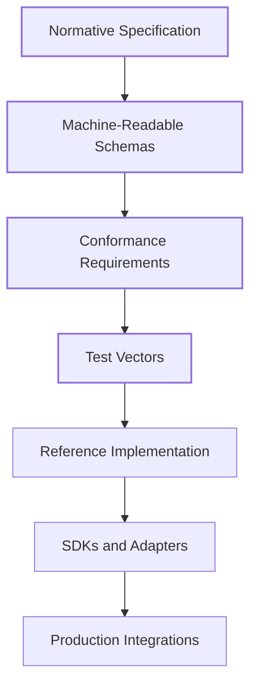

The reference implementation demonstrates one possible implementation of the standard.

It does not define the standard.

Alternative implementations in Python, Rust, Go, Java, TypeScript or other languages should be able to claim conformance by passing the same deterministic test suite.

> **Specification before implementation. Governance before evolution.**

---

## Core architectural principle

SAI-AUT-OS separates intelligence from the governance of its evolution.

The Foundation Core may remain immutable or tightly controlled.

Adaptive components may evolve according to explicit policies.

The Evolution Control Plane evaluates every candidate change before it can alter the active system configuration.

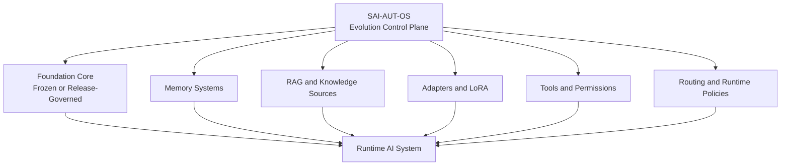

The model is not expected to govern itself without constraint.

Governance remains an independent system function.

---

## Kernel space and adaptive space

SAI-AUT-OS applies a separation comparable to kernel space and user space.

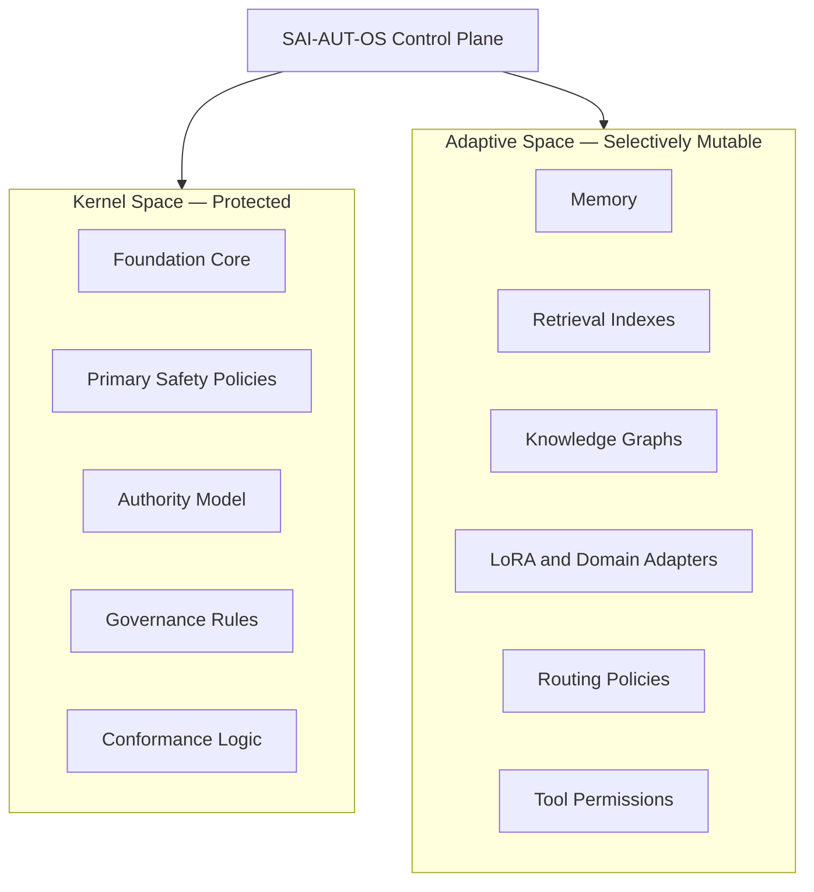

Adaptive space is not unrestricted.

Each component has an explicit mutability class, risk level, authority requirement and validation profile.

---

## Evolution lifecycle

Every proposed change follows a standard lifecycle.

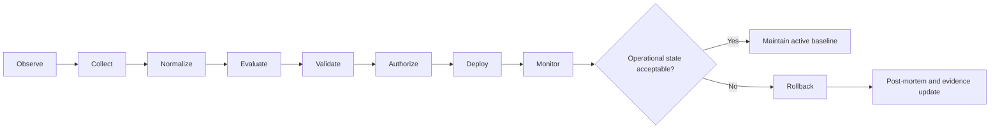

This lifecycle transforms AI adaptation from an implicit behavioural event into an explicit, auditable engineering process.

---

## Cognitive Configuration Items

The atomic governance object in SAI-AUT-OS is the **Cognitive Configuration Item — CCI**.

A CCI represents a proposed or deployed change to an adaptive AI system.

A conformant CCI includes, at minimum:

* unique identifier;
* update class;
* target component;
* provenance;
* contributor authority;
* digital signature or integrity evidence;
* scope;
* effectivity;
* lifecycle state;
* evidence package;
* risk classification;
* validation results;
* baseline relationship;
* deployment record;
* rollback anchor.

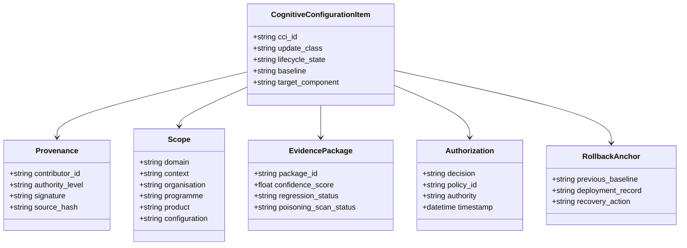

The CCI is the unit of Cognitive Configuration Management.

---

## Selective autonomy

SAI-AUT-OS does not treat every update as equivalent.

Different classes of change require different levels of governance.

| Class                    | Target                                                | Typical autonomy                     |
| ------------------------ | ----------------------------------------------------- | ------------------------------------ |
| **U0 — Foundation Core** | Base-model weights and primary safety mechanisms      | Frozen or externally governed        |
| **U1 — Memory**          | Episodic, user, organisational or runtime memory      | Bounded autonomous                   |
| **U2 — Knowledge**       | RAG corpora, indexes and knowledge graphs             | Autonomous after evidence validation |
| **U3 — Runtime Policy**  | Routing, ranking, prompts and tool-selection policies | Context-dependent                    |
| **U4 — Adapter**         | LoRA and domain-specific adapters                     | Supervised or tightly bounded        |
| **U5 — Core Candidate**  | Candidate foundation-model update                     | Formal release process only          |

The classification is extensible through governed registries.

A policy may permit an autonomous U1 update while requiring human ratification for U4 and prohibiting autonomous U0 changes entirely.

---

## Decision model

For a candidate update $u$, the baseline authorisation decision can be represented as:

$$
\text{Allow}(u) = D(u) \land C(u) \land M(u) \land A(u) \land E(u) \land R(u) \land V(u)
$$

Where:

- **\(D(u)\)** — il dominio è autorizzato  
- **\(C(u)\)** — il contesto operativo è valido  
- **\(M(u)\)** — il componente bersaglio è mutabile  
- **\(A(u)\)** — autorità del proponente sufficiente  
- **\(E(u)\)** — soglia di evidenze soddisfatta  
- **\(R(u)\)** — rischio accettabile  
- **\(V(u)\)** — convalida e regressioni superate

The normative specification may define boolean gates, weighted evaluations or hybrid models.

However, no weighted score may override a mandatory hard-fail condition.

---

## Effectivity

A valid update is not necessarily valid everywhere.

SAI-AUT-OS applies the engineering concept of **effectivity** to AI evolution.

An update may be valid only for a specific:

* organisation;
* programme;
* product;
* model family;
* customer;
* jurisdiction;
* deployment;
* user group;
* lifecycle phase;
* configuration baseline;
* time interval.

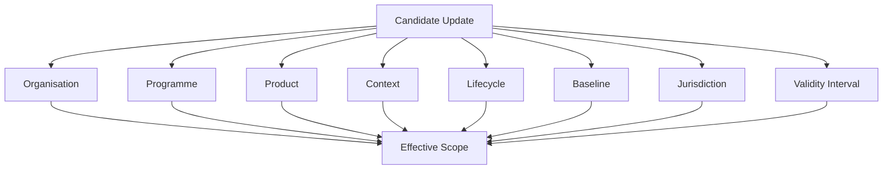

This prevents a locally valid adaptation from becoming an unjustified global assumption.

---

## Evidence-driven evolution

Every update must be supported by an **Evidence Package**.

Evidence may include:

* capability benchmarks;
* regression tests;
* semantic-drift measurements;
* retrieval precision;
* latency and resource impact;
* robustness tests;
* poisoning detection;
* privacy checks;
* safety evaluations;
* expert review;
* operational feedback;
* provenance and integrity verification.

SAI-AUT-OS treats these signals in a manner conceptually similar to how observability systems treat metrics, traces and logs.

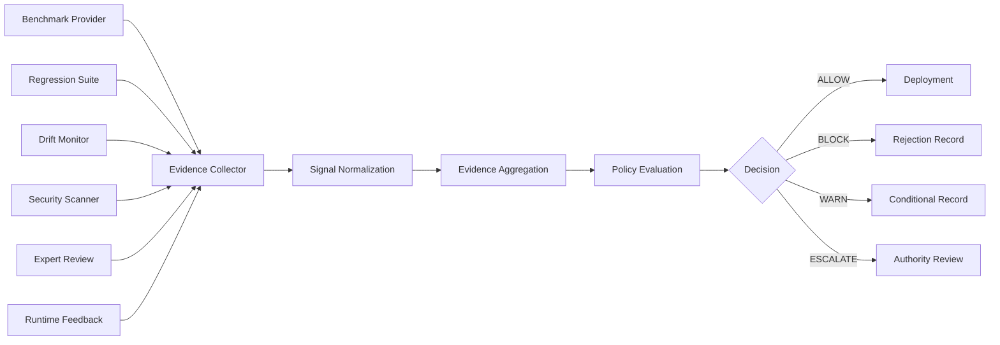

Evidence providers remain pluggable.

The standard defines the common representation and semantics, not a mandatory vendor or evaluation service.

---

## OpenTelemetry-inspired, not OpenTelemetry-dependent

SAI-AUT-OS aims to do for AI evolution what OpenTelemetry did for observability:

* define shared semantic conventions;
* standardise machine-readable signals;
* separate collection from storage;
* remain vendor-neutral;
* support multiple runtimes and backends;
* enable interoperable tooling.

The conceptual mapping is:

| OpenTelemetry        | SAI-AUT-OS                           |
| -------------------- | ------------------------------------ |
| Trace                | Evolution chain                      |
| Span                 | CCI lifecycle stage                  |
| Metric               | Evidence signal                      |
| Log                  | Ledger record                        |
| Resource             | Runtime and effectivity context      |
| Collector            | Evidence Collector and Control Plane |
| Exporter             | Deployment or ledger adapter         |
| Semantic conventions | Governance vocabulary                |

The parallel is architectural, not functional.

OpenTelemetry observes what a system has done.

SAI-AUT-OS governs what an AI system is allowed to become.

---

## Ledger and traceability

Every governed transition must produce an immutable or tamper-evident record.

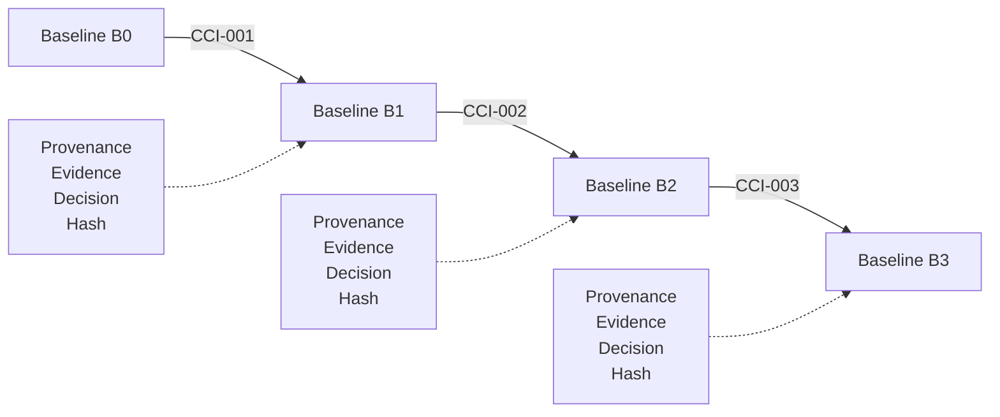

The ledger must support:

* baseline reconstruction;
* decision audit;
* provenance verification;
* deployment-history inspection;
* rollback-target resolution;
* supersession tracking;
* post-mortem analysis.

A blockchain is not required.

A conformant implementation may use a hash-chained log, append-only database, signed event stream or equivalent tamper-evident mechanism.

---

## Rollback is a first-class operation

Rollback is not an exceptional administrative feature.

It is part of the standard lifecycle.

A conformant deployment process must preserve enough information to:

1. identify the previously valid baseline;
2. deactivate the current adaptive component;
3. restore the previous component or configuration;
4. update runtime routing atomically;
5. record the rollback event;
6. preserve the failed CCI for investigation;
7. prevent automatic reactivation without renewed authorisation.

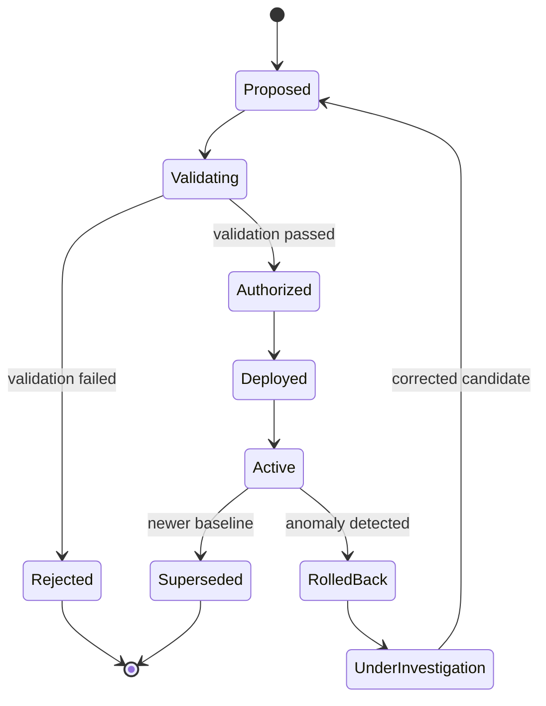

---

## Conformance

The existence of schemas alone does not create a standard.

SAI-AUT-OS defines conformance classes and deterministic test vectors.

A preliminary conformance model may include:

### L0 — Record Conformance

The implementation can create, validate and store conformant CCIs, Evidence Packages and deployment records.

### L1 — Decision Conformance

The implementation can evaluate normative policies and produce deterministic `ALLOW`, `BLOCK`, `WARN` or `ESCALATE` decisions.

### L2 — Lifecycle Conformance

The implementation supports the complete lifecycle from observation to deployment, monitoring and rollback.

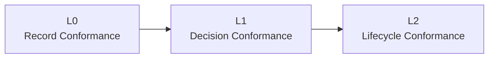

Conformance claims must be verifiable using the public test runner and golden test vectors.

---

## Governance

SAI-AUT-OS distinguishes technical execution from normative authority.

The project governance model must define:

* who may propose amendments;
* how RFCs are reviewed;
* who may ratify normative changes;
* how conflicts of interest are handled;
* how registries are updated;
* how security issues are disclosed;
* how implementation feedback enters the specification;
* how emergency amendments are processed;
* how minority objections are recorded.

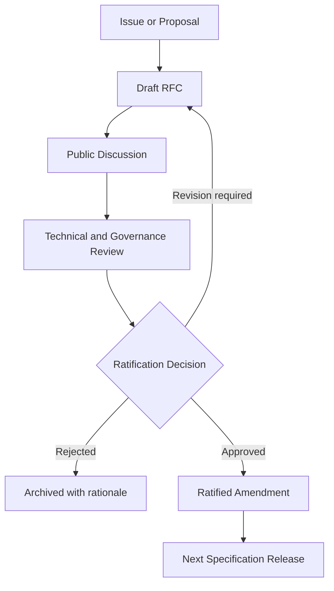

The specification is governed openly.

No single implementation, vendor or model provider should control its normative evolution.

---

## Repository architecture

```text
SAI-AUT-OS/
├── README.md
├── LICENSE
├── GOVERNANCE.md
├── CODE_OF_CONDUCT.md
├── CONTRIBUTING.md
├── SECURITY.md
├── VERSIONING.md
├── CHANGELOG.md
│
├── constitution/                    # Technical Constitution for AI evolution
├── spec/                            # Normative specification, amendments, RFCs
├── schemas/                         # Normative machine-readable schemas
├── policies/                        # Reference policy packs
├── conformance/                     # Conformance levels, profiles, test vectors
├── registry/                        # Official registries (IANA-style)
├── sdk/                             # Developer SDKs (non-normative)
├── impl/                            # Non-normative reference implementation
├── adapters/                        # Ecosystem integrations
├── telemetry/                       # Evidence collectors, exporters, OTel bridge
├── examples/                        # End-to-end use cases
├── docs/                            # Explanatory documentation and the public manifesto
├── tools/                           # Deterministic scaffolding and validation
└── .github/workflows/               # CI, including the structural conformance gate
```

The repository deliberately separates:

* constitutional text (highest precedence);
* normative text;
* machine-readable normative artefacts;
* official registries;
* conformance tests;
* non-normative implementation code;
* explanatory documentation.

The structure itself is a controlled artifact: its single source of truth is
`tools/scaffold.py`, and CI verifies it on every push.

---

## Initial reference scenarios

The first reference scenarios are intended to demonstrate different update classes and risk profiles.

### Memory update

A system proposes adding a new item to organisational or user memory.

The control plane verifies provenance, scope, privacy constraints and expiry rules.

### RAG corpus update

A new document or knowledge source is proposed for ingestion.

The control plane checks provenance, integrity, duplication, poisoning risk, retrieval quality and effectivity.

### LoRA adapter promotion

A candidate domain adapter demonstrates improved task performance.

The control plane validates regression results, authority requirements, compatibility and rollback readiness before promotion.

### Tool-permission change

An agent requests permission to invoke a new tool or perform a new operation.

The control plane evaluates authority, risk, context and least-privilege requirements.

---

## Design principles

SAI-AUT-OS is based on the following principles:

1. **Specification before implementation.**
2. **Governance before evolution.**
3. **No evolution without evidence.**
4. **No update without effectivity.**
5. **No deployment without a rollback anchor.**
6. **No authority without traceability.**
7. **No weighted score may override a hard safety gate.**
8. **The Foundation Core and adaptive components must remain distinguishable.**
9. **Governance must remain independent from the system being governed.**
10. **Open standards must prevent vendor lock-in.**
11. **Conformance must be testable.**
12. **Every evolution must be reconstructable.**

---

## Vision

Open source liberated software from exclusive control.

Open standards made the Internet interoperable.

OpenTelemetry created a common language for observability.

SAI-AUT-OS aims to create a common language for **AI evolution**.

The objective is not to eliminate human governance.

The objective is not to grant AI unrestricted self-modification.

The objective is to make selective autonomous evolution technically possible, institutionally accountable and operationally reversible.

SAI-AUT-OS envisions AI systems that are neither permanently frozen nor allowed to change without constraint.

They are **constitutionally adaptive**.

They evolve through open rules.

They evolve through verifiable evidence.

They evolve within explicit boundaries.

They evolve without surrendering traceability.

Because true freedom is not the absence of rules.

**True freedom is self-determination.**

---

## Project status

SAI-AUT-OS is currently a conceptual and specification-stage open-source project.

The initial milestones are:

* publish the manifesto and governance model;
* define the controlled terminology;
* formalise the CCI lifecycle;
* publish the first JSON Schemas;
* define the baseline policy language;
* create deterministic conformance vectors;
* release a minimal Python reference implementation;
* demonstrate memory, RAG, LoRA and permission-governance scenarios;
* invite public RFCs and independent implementations.

---

## Contributing

SAI-AUT-OS welcomes contributions from:

* AI and machine-learning engineers;
* systems architects;
* MLOps and platform engineers;
* safety and security specialists;
* configuration-management experts;
* regulated-industry professionals;
* policy-language designers;
* standards specialists;
* open-source maintainers;
* researchers in continual learning and adaptive systems.

Contributions should distinguish clearly between:

* normative proposals;
* implementation contributions;
* explanatory documentation;
* experimental research;
* ecosystem integrations.

See [`CONTRIBUTING.md`](CONTRIBUTING.md) and [`GOVERNANCE.md`](GOVERNANCE.md).

---

## Licensing

The intended licensing model is:

* **Apache License 2.0** for source code, SDKs, tools and reference implementations;
* **Creative Commons Attribution 4.0 International** for normative specification text and explanatory documentation.

The final licensing structure must ensure that implementations remain open to commercial and non-commercial adoption while preserving attribution and public accessibility of the standard.

---

## Closing statement

> **SAI-AUT-OS is not an AI framework. It is an Evolution Control Plane.**

It separates intelligence from the governance of its evolution.

It transforms adaptive changes into governed configuration items.

It makes evidence, authority, effectivity, conformance and rollback part of the AI lifecycle.

It seeks to establish Cognitive Configuration Management as an open engineering discipline.

**Every AI evolution should be explainable, traceable and reversible.**
