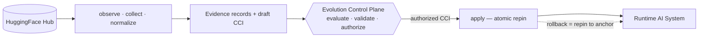

<!-- sai-aut-os:seed scaffold=0.2.0 spec=1.0.0-draft.1 -->

# adapters/huggingface — HuggingFace Hub Binding

**Status:** Non-normative (authored) · **Layer:** Integration · **Spec:** v1.0.0-draft.1

## Why this is the first adapter

The HuggingFace Hub is built on git: every repository has immutable,
content-addressed revisions; every large file carries a SHA-256; every model
card declares metadata, license, lineage and evaluation results.

**The Hub already speaks configuration management.** This binding invents no
governance — it only translates the Hub's native grammar into SAI-AUT-OS
objects, so that model, adapter and dataset evolution can be governed by the
control plane like any other Cognitive Configuration Item.

## The binding

| Hub concept | SAI-AUT-OS object | Notes |
|---|---|---|
| Repository (model / dataset) | Source of an Adaptive Component | PEFT/LoRA repo ⇢ `lora-adapter`; dataset repo ⇢ `rag-index` |
| Commit SHA (revision) | Baseline identity | Immutable by construction |
| Locally pinned revision | Active baseline · rollback anchor | The pin, not `main`, is the truth |
| New commit on a tracked repo | Candidate update (Observe) | |
| Per-file SHA-256 (LFS) | Provenance integrity · `payload_hash` | Tamper-evident manifests |
| Model card metadata & metrics | Evidence (`attestation`, `metric`) | Declared, hash-bound, replayable |
| Gated / private repo, token scope | Authority *prerequisite* | Recorded as provenance; authority is decided by the control plane, never by the adapter |
| Revision pin per environment | Effectivity | e.g. staging pinned ahead of production |



## Update classes bound by this adapter

| Repo kind | Update class (`registry/update-types/`) | Adaptive component |
|---|---|---|
| PEFT / LoRA adapter repo | `lora-adapter-promotion` | `lora-adapter` |
| Dataset / corpus repo | `rag-corpus-update` | `rag-index` |

Base-model revision bumps are deliberately **out of scope** for autonomous
handling: the adapter can observe them, but proposal routing for
foundation-core candidates awaits the U-class reconciliation (RFC-0003).

## Lifecycle coverage

| Stage | Owner | This adapter |
|---|---|---|
| Observe | adapter | `observe()` — pinned SHA ≠ head SHA ⇒ candidate |
| Collect | adapter | `collect()` — revision metadata, file manifests, card |
| Normalize | adapter | `normalize()` — Evidence records (`evidence.schema.json`) |
| Evaluate | **control plane** | — never this adapter |
| Validate | **control plane** | — never this adapter |
| Authorize | **control plane** | — never this adapter |
| Deploy | adapter, on authorized CCI | `apply_authorized()` — CAS repin + Deployment Record draft |
| Rollback | adapter, on control-plane order | `execute_rollback()` — repin to anchor + Rollback record draft |

## Pinning discipline

1. Tracked repos are pinned by full commit SHA. `main` is treated as a smell,
   not a baseline.
2. `apply_authorized()` is **compare-and-swap**: it refuses if the live pin no
   longer matches the CCI's declared rollback anchor (the proposal has gone
   stale ⇒ re-propose). Repinning is therefore atomic with respect to the
   proposal it executes.
3. Rollback is a repin to `rollback_target`. Because Hub revisions are
   immutable, the anchor is always resolvable: this binding satisfies
   SAO-RBK-001 by construction.

## What this adapter never does

- It never evaluates, scores, authorizes, or blocks — it drafts and applies.
- It never applies a CCI without an Authorization record whose decision is
  `allow` and whose `cci_id` matches.
- It never writes to the Hub. The Hub is a source; the pin store is the sink.
- It never resolves floating refs at apply time. SHAs in, SHAs out.

## Reference implementation

```text
adapters/huggingface/
├── README.md                    # this binding specification
├── hf_adapter.py                # observe / collect / normalize / propose / apply / rollback
├── fixtures/
│   └── hub_snapshot.json        # deterministic Hub snapshot (offline)
└── tests/
    └── test_hf_adapter.py       # deterministic tests; validates drafts against schemas/
```

The core is **deterministic and offline**: `SnapshotClient` reads a local Hub
snapshot, so the same snapshot + pins yield byte-identical records — the shape
conformance vectors require. `HfApiClient` (optional, needs the
`huggingface_hub` package and network egress) serves live deployments and is
deliberately excluded from tests.

Run from the repository root:

```bash
python adapters/huggingface/tests/test_hf_adapter.py   # deterministic suite
python adapters/huggingface/hf_adapter.py              # end-to-end demo on fixtures
```

## Conformance posture

Draft records produced here validate against five seed schemas — `cci`,
`evidence`, `authorization` (consumed), `deployment-record`, `rollback` — and
test assertions cite the requirement IDs they exercise (SAO-EVD-001,
SAO-RBK-001, SAO-AUT-001). The adapter honours the **ratified** decision
grammar (`allow / deny / escalate`); `BLOCK`/`WARN` semantics land with
RFC-0001, and `apply_authorized()` says so when refusing.
