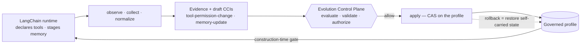

# adapters/langchain — LangChain Runtime Binding

**Status:** Non-normative (authored) · **Layer:** Integration · **Spec:** v1.0.0-draft.1

## Why this adapter is the mirror of `adapters/huggingface`

The HuggingFace binding translated an existing configuration-management
grammar — immutable git revisions, per-file hashes — into CCM objects.

LangChain has no such grammar. Tools are bound in Python code at runtime;
memory mutates freely across a conversation; nothing is versioned, hashed, or
pinned by the substrate itself.

So this binding does the opposite job: **it manufactures the grammar the
substrate lacks.** Canonical manifests where there were Python objects,
content hashes where there was mutable state, and a **governed profile** that
plays the role the Hub's commit history played for `huggingface/` — the
synthetic baseline everything is diffed against and rolled back to.

One consequence dominates the design: where the substrate keeps no history,
**the CCI must carry its own.** Every draft embeds the state needed for
reversal, bound by hash to the declared rollback anchor; rollback verifies
that resolvability before restoring anything. Reversal is self-contained and
tamper-evident.

## The binding

| LangChain concept | SAI-AUT-OS object | Notes |
|---|---|---|
| Tool (`name` + `description` + `args_schema` + permissions) | Entry in the Tool Binding Manifest | A tool's **description is executable configuration** — it steers model routing. A changed description is a changed permission surface. |
| An agent's toolset | `tool-binding` adaptive component | Identity = SHA-256 of the canonical manifest |
| Governed profile (this adapter's store) | Synthetic baseline · rollback anchor | The pin store LangChain never had |
| Persistent memory item | Content-addressed `memory` entry | Identity = SHA-256 of the content |
| Staged memory (outbox) | Candidate `memory-update` | Promotion, not mutation, is what gets governed |
| Ephemeral conversation buffer | **Out of scope** | Governance granularity: not every token is a CCI |
| Session / chain identity | Provenance | Who proposed, from which run |
| Store / user / organisation | Scope & effectivity | Local validity never silently globalizes |



## Update classes bound by this adapter

| Runtime event | Update class (`registry/update-types/`) | Adaptive component |
|---|---|---|
| Toolset diff vs profile (added / removed / changed tool) | `tool-permission-change` | `tool-binding` |
| Staged memory batch awaiting promotion | `memory-update` | `memory` |

Manifesto U-class mapping (`tool-permission-change` ⇢ U3, `memory-update` ⇢ U1)
follows the registry reconciliation in RFC-0003.

## Lifecycle coverage

| Stage | Owner | This adapter |
|---|---|---|
| Observe | adapter | `observe_tools()` / `observe_memory()` — declared toolset hash ≠ profile hash; staged items present |
| Collect | adapter | `collect_tools()` — manifests, diffs, staged batches |
| Normalize | adapter | `normalize_tools()` / `normalize_memory()` — Evidence records (`evidence.schema.json`), content bound **by hash only** |
| Evaluate / Validate / Authorize | **control plane** | — never this adapter |
| Deploy | adapter, on authorized CCI | `apply_authorized_tools()` / `apply_authorized_memory()` — CAS on the profile + Deployment Record draft |
| Rollback | adapter, on control-plane order | `execute_rollback_tools()` / `execute_rollback_memory()` — integrity-verified restore of the anchored state |

## Self-contained reversal

`hf:` anchors resolve against the Hub, which stores every revision forever.
`lc:` anchors have nothing to resolve against — so:

1. Every applied state is anchored in a **content-addressed, append-only
   store** (hash → canonical object): the manufactured immutable history.
2. The rollback anchor is the SHA-256 of the prior state's canonical form
   (or the `absent` sentinel when the key did not exist).
3. `execute_rollback_*()` resolves the anchor and **refuses** when it is
   unresolvable: a missing or tampered prior state can never be restored
   silently.

This keeps SAO-RBK-001 honest on a substrate with no memory of its own.

## Memory: promotion, granularity, privacy

Only the ephemeral→persistent transition is governed. Working buffers churn
freely; the moment content is staged for a persistent store it becomes a
candidate `memory-update`, carrying source, scope and TTL.

Evidence binds memory **by content hash only** — evidence records never carry
the text of a memory. Hard erasure is itself a governed operation: the
hash-tombstone pattern lets the identity survive in the ledger while the
content is destroyed, reconciling total traceability with redaction duties.

## What this adapter never does

- It never evaluates, authorizes, or blocks — it drafts and applies.
- It never lets an agent self-grant a tool: **declaration is not
  authorization.** `enforce_tools()` is the construction-time gate — a
  declared-but-unauthorized toolset never reaches the agent factory.
- It never puts memory content into evidence or the ledger — hashes only.
- It never applies without an Authorization whose decision is `allow` and
  whose `cci_id` matches, and never past a drifted profile (CAS).

## Reference implementation

```text
adapters/langchain/
├── README.md                      # this binding specification
├── lc_adapter.py                  # observe / collect / normalize / propose / apply / rollback
├── fixtures/
│   └── runtime_snapshot.json      # deterministic runtime snapshot (offline)
└── tests/
    └── test_lc_adapter.py         # deterministic tests; validates drafts against schemas/
```

The core is deterministic and offline: `load_fixture()` reads a local runtime
snapshot; identical snapshot + profile yield byte-identical records.
`from_langchain_tools()` (optional, duck-typed — no `langchain-core` import
required) builds specs from live `BaseTool` objects and is deliberately
excluded from tests.

Run from the repository root:

```bash
python adapters/langchain/tests/test_lc_adapter.py   # deterministic suite
python adapters/langchain/lc_adapter.py              # end-to-end demo on fixtures
```

## Conformance posture

Draft records validate against five seed schemas — `cci`, `evidence`,
`authorization` (consumed), `deployment-record`, `rollback` — and assertions
cite the requirement IDs they exercise (SAO-EVD-001, SAO-RBK-001,
SAO-AUT-001). The ratified decision grammar (`allow / deny / escalate`) is
honoured; `BLOCK`/`WARN` semantics arrive with RFC-0001, and refusals say so.
