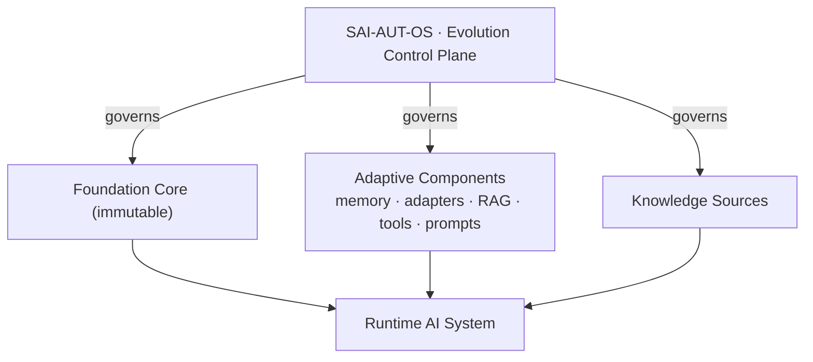

<!-- sai-aut-os:seed scaffold=0.2.0 spec=1.0.0-draft.1 -->

# Architecture

**Status:** Normative · **Spec:** v1.0.0-draft.1

The Foundation Core remains stable (SAO-COR-001). Adaptive components
evolve. The control plane determines whether evolution is allowed, by
running the update lifecycle over CCIs.

Separation of concerns, by analogy with modern engineering: intelligence
is separated from the governance of its evolution, as applications are
separated from orchestration and code from version control.
