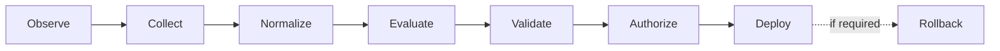

<!-- sai-aut-os:seed scaffold=0.2.0 spec=1.0.0-draft.1 -->

# Update Lifecycle

**Status:** Normative · **Spec:** v1.0.0-draft.1

| Stage | Consumes | Produces | Schema |
|---|---|---|---|
| Observe | Runtime signals | Candidate signal | — |
| Collect | Candidate signal | Raw evidence | — |
| Normalize | Raw evidence | Evidence records | `evidence.schema.json` |
| Evaluate | CCI + evidence | Evaluation result (deterministic) | part of CCI `validation` |
| Validate | Evaluation result | Validation result (gates) | part of CCI `validation` |
| Authorize | CCI + policy | Authorization record | `authorization.schema.json` |
| Deploy | Authorized CCI | Deployment record | `deployment-record.schema.json` |
| Rollback | Deployment record | Rollback record | `rollback.schema.json` |

Every produced record is appended to the ledger (SAO-LGR-001).
Every evolution becomes observable. Every evolution becomes governed.
